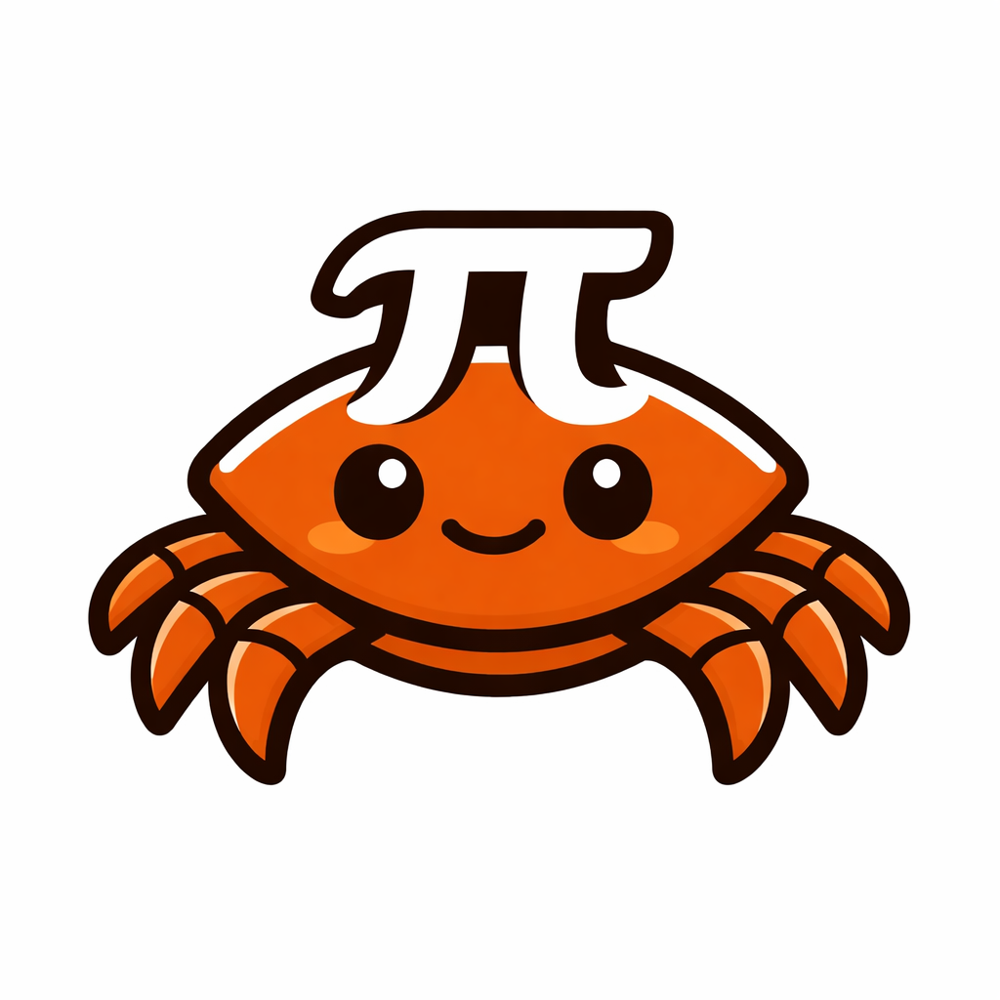

<p align="center">
  
</p>

<h1 align="center">PiCrust: Pi, but in Rust </h1>

<p align="center">
  <strong><a href="https://github.com/openagentsinc/openagents/tree/main/packages/pi">Pi</a>, but in Rust</strong><br>
  The agent loop that powers OpenClaw, with parallel runtimes, native binaries, and structured permissions.
</p>

<p align="center">
  <a href="https://github.com/HourSense/picrust/blob/main/LICENSE"></a>
  <a href="https://crates.io/crates/picrust"></a>
  <a href="https://docs.rs/picrust"></a>
</p>

<p align="center">
  <a href="#philosophy">Philosophy</a> •
  <a href="#quick-start">Quick Start</a> •
  <a href="https://docs.framework.vibeworkapp.com/">Documentation</a>
</p>

---

## Philosophy

[Pi](https://github.com/openagentsinc/openagents/tree/main/packages/pi) proved that the best agent architecture is the simplest one: a while loop with tools. No graphs, no DAGs, no state machines. Just call the LLM, execute whatever tools it asks for, feed results back, repeat. [Claude Code](https://docs.anthropic.com/en/docs/claude-code) proves this works at scale.

PiCrust takes that insight and rebuilds it in Rust for a different use case: **AI employees**.

### Assistants vs. Employees

A coding assistant (Claude Code, Cursor, Pi) sits in your terminal, pair-programs with you, and waits for instructions. An AI employee does work on its own. It handles your email while you're in a meeting. It builds a presentation from a brief overnight. It juggles multiple tasks concurrently, the way a human employee would.

Most agent frameworks are built for the assistant model. PiCrust is built for the employee model. That difference drives every architectural decision.

### What an AI employee actually needs

- **Long-running, crash-safe sessions.** An employee doesn't lose its memory when the process restarts. It needs append-only persistence that survives power failures, OOM kills, and deployment restarts without corrupting state.
- **Parallel task execution.** A human employee doesn't finish one task before starting another. They context-switch. An AI employee needs the same: multiple agent loops running concurrently on a single runtime, each with isolated state but sharing compute resources.
- **Full system access.** Filesystem, desktop apps, browser automation, shell execution. The ability to reach out and actually touch things, not just generate text in a sandbox.
- **Structured permission controls.** With great access comes great responsibility. You need hooks, permission layers, and safety guardrails that can intercept dangerous operations before they execute, without crippling the agent's autonomy.
- **Cross-platform native binaries.** If your AI employee runs on each user's machine, you can't afford to ship a Python runtime or Node.js installation with it. You need a single binary that runs anywhere.

### Why Rust

Rust makes agent code easier for both humans and LLMs to understand. No inheritance hierarchies. No dynamic typing. No runtime magic. Every function signature tells you exactly what goes in and what comes out. When Claude reads PiCrust's source to understand how to build on it, there's zero ambiguity. The types tell the whole story.

The practical benefits go beyond readability. Rust compiles to a native binary. No runtime. No dependencies beyond the OS. No Node.js overhead, no Python version conflicts, no dependency hell. For an AI employee that ships to user machines or runs in per-user VMs, a single native binary with zero runtime dependencies is table stakes.

### Where we diverge from Pi

| | Pi | PiCrust |
|---|---|---|
| **Language** | TypeScript | Rust |
| **Tools** | 4 built-in, self-extending | 9 built-in + Tool trait |
| **Extensions** | Dynamic hot-reload | Compiled Rust traits |
| **MCP** | Not included (by design) | Built-in via ToolProvider |
| **Concurrency** | One agent per process | Many agents on one async runtime |
| **Target** | Coding assistants | AI employees |

Pi's approach of "four tools and extend yourself" is elegant for a coding agent where the human is in the loop. For an AI employee running autonomously, you need a richer base toolkit, compile-time safety, and parallel runtimes from day one.

> Read the full story: [PiCrust: What If Pi Was Written in Rust?](https://vibework.ai/blog/picrust)

---

## Quick Start

### Installation

Add to your `Cargo.toml`:

```toml
[dependencies]
picrust = { path = "path/to/picrust" }
tokio = { version = "1", features = ["full"] }
anyhow = "1.0"
```

### Minimal Example

```rust
use std::sync::Arc;
use picrust::{
    agent::{AgentConfig, StandardAgent},
    llm::{AnthropicProvider, LlmProvider},
    runtime::AgentRuntime,
    session::AgentSession,
    tools::ToolRegistry,
};

#[tokio::main]
async fn main() -> anyhow::Result<()> {
    // 1. Create LLM provider (reads ANTHROPIC_API_KEY and ANTHROPIC_MODEL from env)
    let llm: Arc<dyn LlmProvider> = Arc::new(AnthropicProvider::from_env()?);

    // 2. Create runtime (manages all agents)
    let runtime = AgentRuntime::new();

    // 3. Create session (persists conversation)
    let session = AgentSession::new(
        "my-session",      // unique ID
        "assistant",       // agent type
        "My Assistant",    // display name
        "A helpful agent", // description
    )?;

    // 4. Configure and create agent
    let config = AgentConfig::new("You are a helpful assistant.")
        .with_streaming(true);
    let agent = StandardAgent::new(config, llm);

    // 5. Spawn agent
    let handle = runtime
        .spawn(session, |internals| agent.run(internals))
        .await;

    // 6. Send input and receive output
    let mut rx = handle.subscribe();
    handle.send_input("Hello!").await?;

    // 7. Process output stream
    loop {
        match rx.recv().await {
            Ok(chunk) => {
                use picrust::core::OutputChunk;
                match chunk {
                    OutputChunk::TextDelta(text) => print!("{}", text),
                    OutputChunk::Done => break,
                    OutputChunk::Error(e) => eprintln!("Error: {}", e),
                    _ => {}
                }
            }
            Err(_) => break,
        }
    }

    Ok(())
}
```

---

## Documentation

For the full documentation covering core concepts, key features, module reference, frontend integration, examples, and API reference:

- **Full docs:** [docs.framework.vibeworkapp.com](https://docs.framework.vibeworkapp.com/)
- **Detailed reference:** [docs/DETAILED_DOCS.md](DETAILED_DOCS.md)

## License

MIT
